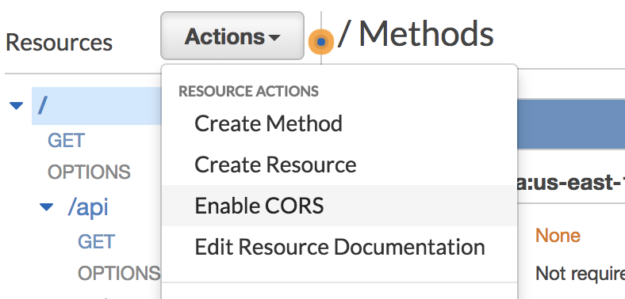
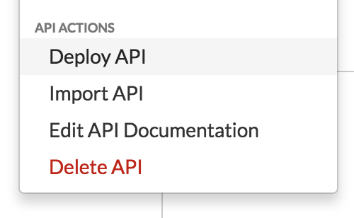
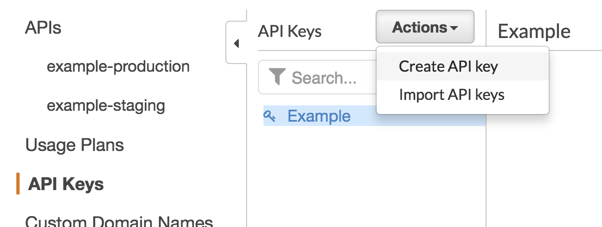

# Implement CORS

> CORS is required if your application reaches across domains to request resources

What if you haven't your entire application using `arc`?

Perhaps your frontend is hosted somewhere else, or you're starting out with a single Lambda function within a larger system.

Or perhaps you’ve set up an API using `arc`, but are now getting an error message in your browser console like, `No 'Access-Control-Allow-Origin' header is present on the requested resource`, or, `CORS header ‘Access-Control-Allow-Origin’ missing,` when trying to access the API from your existing site.

According to the MDN web docs, for security reasons, a web application using `window.fetch`, `XMLHttpRequest`, jQuery’s `$.ajax`:

> can only request HTTP resources from the same domain the application was loaded from unless CORS headers are used.
> <footer> MDN web docs, [CORS](https://developer.mozilla.org/en-US/docs/Web/HTTP/CORS)</footer>

To set these headers, you’ll need to enable CORS within the AWS Console, and then write the code to make your request from your existing site to your cloud function. 

## Enabling CORS via the AWS Console

Let's first create a `.arc` app with very simple JSON API endpoint:

```arc
@app
testapp

@html
get /

@json
get /api
```

1. Go to [API Gateway](https://console.aws.amazon.com/apigateway) in the AWS console
2. Add CORS by: going to API Gateway &rarr; select `{your API name}-production` &rarr; open the **Actions** dropdown &rarr; Select **Enable CORS**
  
3. Choose **Deploy API**
  
4. Repeat the previous two steps for staging
5. Create an API Key by: going to the **API Keys** view in the left nav &rarr; open the **Actions** dropdown &rarr; Select **Create API key**
  

If you ever need need to revoke access to one of the API keys you create, you can return to this section of the AWS console.

Ok, so now that you have an API key, you can use it to make a test request from your terminal. For example:

```sh
curl --header "x-api-key: aA01etc1234567890234567890" \
https://example.execute-api.us-east-1.amazonaws.com/production/api/
```

With the default `.arc` file, this should return:

```json
{ "msg": "hello world" }
```

If you get the result you expect back, you're ready to use the API and API key within your existing site or client-side application.

## Using Your API Across Fomains

Using `window.fetch`, this might look something like:
  
```javascript
// The API key you just created
var apiKey = 'aA01etc1234567890234567890'

// The production URL to your API
var api = 'https://example.execute-api.us-east-1.amazonaws.com/production/api/'

window
  .fetch(api, {
    headers: { 'x-api-key': apiKey },
  })
  .then(function(res) {
    return res.json()
  })
  .then(function(json) {
    // { msg: 'hello world' }
    console.log(json)
  })
  .catch(function(err) {
    console.warn(err)
  })
```

## Restricting Domains

CORS isn't really used to restrict requests from certain domains, but you can do that within your function as well.

Continuing from the `/api` endpoint, your API might operate differently based on the request's domain of origin:

```javascript
var arc = require('@architect/functions')

// Example permitted domains
var permittedDomains = [
  'http://localhost:3000',
  'https://example.com'
]

function route(req, res) {
  console.log(JSON.stringify(req, null, 2))

  if (permittedDomains.includes(req.headers.origin)) {
    // Things that should only be done for permitted
    // requests. Get data, etc.
    res({
      json: { msg: `hello world` },
    })
  } else {
    // Send a different response to requests that
    // aren’t permitted to access this API
    res({
      json: { msg: `you don’t have permission to access` },
    })
  }
}

exports.handler = arc.json.get(route)
```

## Conclusion

With CORS implemented, you can now make full use of your `arc` application within your existing static sites or client-side applications.

This is a great way to ease into using cloud functions, or adding some "server-side" functionality to an otherwise static site.
